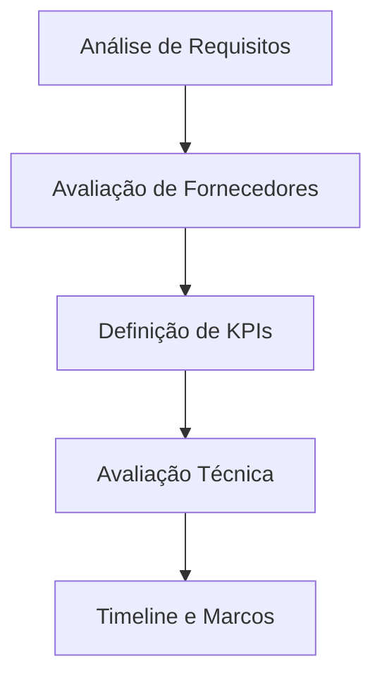

# Melhores Práticas SAS ERP - Grupo AreLuna

## Visão Geral

Este documento estabelece as melhores práticas baseadas nos conceitos ERP da SAS e metodologias comprovadas para implementação no ecossistema Grupo AreLuna.

## Conceitos Fundamentais ERP

### Definição Core
Enterprise Resource Planning (ERP) é um sistema de software que integra os principais processos de negócio de uma organização <mcreference link="https://www.sap.com/products/erp/what-is-erp.html" index="2">2</mcreference>, incluindo:
- Finanças e Contabilidade
- Recursos Humanos
- Manufatura e Produção
- Cadeia de Suprimentos
- Vendas e CRM
- Procurement e Compras

### Princípios SAS ERP

#### 1. **Integração Centralizada**
- **Single Source of Truth**: Todos os dados empresariais em uma base unificada <mcreference link="https://www.sap.com/products/erp/what-is-erp.html" index="2">2</mcreference>
- **Real-time Processing**: Processamento em tempo real para decisões ágeis
- **Cross-departmental Flow**: Fluxo de informações entre departamentos sem silos

#### 2. **Modularidade e Escalabilidade**
- **Core + Extensions**: Sistema ERP central com módulos especializados <mcreference link="https://en.wikipedia.org/wiki/Enterprise_resource_planning" index="3">3</mcreference>
- **Cloud-first Architecture**: Implementação em nuvem para escalabilidade
- **Microservices Approach**: Arquitetura modular para flexibilidade

#### 3. **Value Engineering (VE)**
- **Análise de Valor**: Aplicação da metodologia VE em 5 fases <mcreference link="https://www.researchgate.net/publication/305892420_Enterprise_resource_planning_ERP_implementation_using_the_value_engineering_methodology_and_Six_Sigma_tools" index="4">4</mcreference>:
  1. Knowledge Generation
  2. Analysis
  3. Creation
  4. Development
  5. Execution

## Metodologia de Implementação

### Fase 1: Preparação e Análise


#### Análise de Requisitos de Negócio
- **Stakeholder Engagement**: Envolvimento de todas as partes interessadas <mcreference link="https://www.park.edu/blog/erp-systems-implementation-best-practices/" index="1">1</mcreference>
- **Pain Points Identification**: Mapeamento de ineficiências atuais
- **Workflow Mapping**: Documentação de processos existentes
- **Future State Design**: Definição do estado futuro desejado

#### KPIs Essenciais
- **Process Efficiency**: Melhoria na eficiência de processos
- **Data Accuracy**: Precisão dos dados
- **User Adoption Rate**: Taxa de adoção pelos usuários
- **ROI Measurement**: Retorno sobre investimento

### Fase 2: Arquitetura e Design

#### Stack Tecnológico Recomendado
```typescript
// Arquitetura baseada em Next.js + Supabase (seguindo padrões SAS)
interface ERPArchitecture {
  frontend: "Next.js 14 + TypeScript"
  backend: "Supabase + PostgreSQL"
  auth: "NextAuth.js + Azure AD"
  ui: "Tailwind CSS + shadcn/ui"
  state: "Zustand + React Query"
  validation: "Zod"
  monitoring: "Sentry + Vercel Analytics"
}
```

#### Padrões de Segurança
- **Multi-tenant Architecture**: Isolamento por tenant
- **RBAC Implementation**: Controle de acesso baseado em funções
- **Data Encryption**: Criptografia em trânsito e em repouso <mcreference link="https://www.park.edu/blog/erp-systems-implementation-best-practices/" index="1">1</mcreference>
- **Audit Trail**: Trilha de auditoria completa

### Fase 3: Módulos Core

#### 1. **Financial Management**
```sql
-- Estrutura base para módulo financeiro
CREATE TABLE financial_transactions (
  id UUID PRIMARY KEY DEFAULT gen_random_uuid(),
  tenant_id UUID NOT NULL REFERENCES tenants(id),
  transaction_type VARCHAR(50) NOT NULL,
  amount DECIMAL(15,2) NOT NULL,
  currency VARCHAR(3) DEFAULT 'EUR',
  description TEXT,
  created_at TIMESTAMP DEFAULT NOW(),
  created_by UUID REFERENCES users(id)
);
```

#### 2. **Supply Chain Management**
- **Inventory Tracking**: Rastreamento em tempo real
- **Procurement Automation**: Automação de compras
- **Supplier Integration**: Integração com fornecedores

#### 3. **Human Resources**
- **Employee Lifecycle**: Gestão completa do ciclo de vida
- **Performance Management**: Gestão de desempenho
- **Payroll Integration**: Integração com folha de pagamento

## Implementação Grupo AreLuna

### Estrutura Multi-tenant
```typescript
// Configuração multi-tenant para empresas do grupo
interface TenantConfig {
  institutoAreLuna: {
    modules: ['clinic', 'finance', 'hr']
    customizations: ['appointment-scheduling', 'patient-management']
  }
  pinklegion: {
    modules: ['inventory', 'sales', 'logistics']
    customizations: ['product-catalog', 'order-management']
  }
  vespasianVentures: {
    modules: ['finance', 'portfolio', 'reporting']
    customizations: ['investment-tracking', 'consolidation']
  }
}
```

### Integração com Sistemas Existentes
- **Microsoft Graph**: Integração com Office 365 e Azure AD
- **Zoho CRM**: Sincronização de leads e oportunidades
- **Evolution API**: Comunicação via WhatsApp
- **Existing Platforms**: Integração com sistemas legados

## Melhores Práticas de Desenvolvimento

### 1. **Code Quality**
```json
{
  "eslint": "Linting rigoroso",
  "prettier": "Formatação consistente",
  "husky": "Git hooks para qualidade",
  "jest": "Testes unitários > 90%",
  "playwright": "Testes E2E"
}
```

### 2. **CI/CD Pipeline**
```yaml
# .github/workflows/erp-deployment.yml
name: ERP Deployment
on: [push, pull_request]
jobs:
  test:
    runs-on: ubuntu-latest
    steps:
      - name: Lint & Type Check
      - name: Unit Tests
      - name: E2E Tests
      - name: Security Scan
  deploy:
    needs: test
    runs-on: ubuntu-latest
    steps:
      - name: Deploy to Vercel
      - name: Run Migrations
      - name: Health Check
```

### 3. **Performance Optimization**
- **Edge Computing**: Uso de Vercel Edge Functions
- **Database Optimization**: Índices e queries otimizadas
- **Caching Strategy**: Redis para cache distribuído
- **CDN Integration**: Assets estáticos via CDN

## Metodologia Six Sigma

### DMAIC Process
1. **Define**: Definir problemas e objetivos
2. **Measure**: Medir performance atual
3. **Analyze**: Analisar causas raiz
4. **Improve**: Implementar melhorias
5. **Control**: Controlar e monitorar

### Aplicação no ERP
```typescript
interface SixSigmaMetrics {
  defectRate: number // < 3.4 per million
  processEfficiency: number // > 95%
  customerSatisfaction: number // > 4.5/5
  systemUptime: number // > 99.9%
}
```

## Roadmap de Implementação

### Q1 2025: Foundation
- [ ] Setup da arquitetura base
- [ ] Implementação do sistema de autenticação
- [ ] Módulos core (Company, User, Role)
- [ ] Multi-tenancy setup

### Q2 2025: Core Modules
- [ ] Financial Management
- [ ] Inventory Management
- [ ] Basic CRM functionality
- [ ] Reporting dashboard

### Q3 2025: Advanced Features
- [ ] Supply Chain Management
- [ ] Advanced Analytics
- [ ] Mobile applications
- [ ] API ecosystem

### Q4 2025: Integration & Optimization
- [ ] Third-party integrations
- [ ] Performance optimization
- [ ] Advanced security features
- [ ] AI/ML capabilities

## Métricas de Sucesso

### Técnicas
- **System Performance**: < 2s response time
- **Availability**: > 99.9% uptime
- **Security**: Zero critical vulnerabilities
- **Code Quality**: > 90% test coverage

### Negócio
- **User Adoption**: > 85% active users
- **Process Efficiency**: 30% improvement
- **Cost Reduction**: 20% operational savings
- **ROI**: Positive within 18 months

## Considerações Especiais

### GDPR Compliance
- **Data Minimization**: Coleta mínima necessária
- **Right to Erasure**: Implementação do "direito ao esquecimento"
- **Data Portability**: Exportação de dados do usuário
- **Consent Management**: Gestão de consentimentos

### Escalabilidade
- **Horizontal Scaling**: Auto-scaling baseado em demanda
- **Database Sharding**: Particionamento por tenant
- **Microservices**: Decomposição em serviços independentes
- **Event-driven Architecture**: Comunicação assíncrona

---

**Próximos Passos:**
1. Implementar arquitetura base seguindo estes padrões
2. Configurar pipeline CI/CD
3. Desenvolver módulos core com metodologia SAS
4. Estabelecer métricas de monitoramento
5. Planejar integrações com sistemas existentes