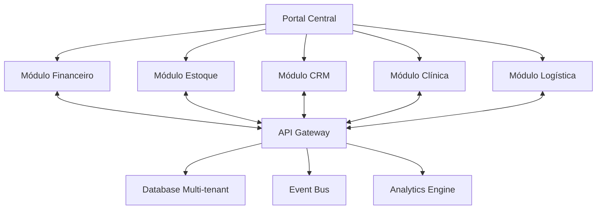

# Roadmap ERP SaaS - Grupo AreLuna
*Baseado em melhores práticas de ERP SaaS modernos*

## 🎯 Visão Geral
Transformar a plataforma Grupo AreLuna em uma solução ERP SaaS de referência empresarial, moderna, ágil e totalmente integrada para todas as empresas do grupo.

---

## 📋 Fase 1: Levantamento e Planejamento (Semanas 1-2)

### 1.1 Levantamento de Necessidades
- **Workshops com usuários-chave** de cada departamento:
  - Instituto AreLuna (clínica/agendamentos)
  - Pinklegion (vendas/manutenção veículos)
  - Nuvens Autóctones (logística/transporte)
  - Papagaio Fotogênico (projetos/audiovisual)
  - ProStoral (dispositivos médicos/leasing)
  - Vespasian Ventures (holding/contratos)

- **Mapeamento de processos essenciais:**
  - Fluxos financeiros (AP/AR, orçamentos)
  - Controle de estoque/inventário
  - Gestão de vendas e CRM
  - Agendamentos e calendários
  - Relatórios e análises

### 1.2 Priorização de Funcionalidades
**Críticas (MVP):**
- ✅ Controle de estoque/inventário
- ✅ Gestão financeira (AP/AR)
- ✅ Sistema de relatórios
- ✅ Agendamentos (clínica)
- ✅ Autenticação multi-tenant

**Secundárias (Fase 2):**
- CRM integrado
- Automações avançadas
- IA embarcada
- App mobile nativo

---

## 🏗️ Fase 2: Arquitetura e Integração (Semanas 3-6)

### 2.1 Integração Total entre Módulos

### 2.2 APIs Bem Documentadas
- **OpenAPI 3.0** em `/api/docs`
- **Webhooks** para integração externa
- **Rate limiting** e autenticação JWT
- **Versionamento** de APIs (v1, v2)

### 2.3 Integração em Tempo Real
- **WebSockets** para atualizações live
- **Event-driven architecture** com Vercel Queues
- **Cache distribuído** com Redis/Upstash
- **Sincronização** entre módulos via eventos

---

## 📊 Fase 3: Relatórios e Analytics (Semanas 7-8)

### 3.1 Painéis Interativos
- **Dashboard executivo** consolidado
- **Relatórios customizáveis** por empresa
- **Filtros dinâmicos** e drill-down
- **Exportação** PDF, Excel, CSV

### 3.2 Indicadores-Chave (KPIs)
**Financeiros:**
- Receita por empresa/departamento
- Fluxo de caixa projetado
- Inadimplência e cobrança

**Operacionais:**
- Produtividade por equipe
- Tempo médio de atendimento
- Utilização de recursos

**Estoque:**
- Giro de estoque
- Itens em falta
- Previsão de compras

---

## 🎨 Fase 4: UX/UI Otimizada (Semanas 9-10)

### 4.1 Interface Responsiva
- **Mobile-first** design
- **Progressive Web App** (PWA)
- **Offline capabilities** básicas
- **Touch-friendly** interactions

### 4.2 Navegação Intuitiva
- **Breadcrumbs** e navegação contextual
- **Atalhos de teclado** (Ctrl+K search)
- **Favoritos** e acesso rápido
- **Onboarding** guiado

### 4.3 Performance Frontend
- **Code splitting** automático
- **Lazy loading** de componentes
- **Image optimization** (Next.js)
- **Bundle analysis** contínuo

---

## 🤖 Fase 5: Automação e Mobilidade (Semanas 11-12)

### 5.1 Automações Implementadas
- **Envio automático** de notas fiscais
- **Disparos de e-mail** personalizados
- **Notificações internas** via push/email
- **Lembretes** de agendamento
- **Atualizações** de estoque automáticas

### 5.2 Versão Mobile
- **React Native** ou PWA avançada
- **Sincronização offline**
- **Notificações push**
- **Acesso por biometria**

---

## 🔒 Fase 6: Segurança e Conformidade (Semanas 13-14)

### 6.1 Segurança Avançada
- **Criptografia** AES-256 para dados sensíveis
- **2FA/MFA** obrigatório para admins
- **Audit logs** completos
- **Penetration testing** trimestral

### 6.2 Conformidade LGPD
- **Consentimento** explícito para dados
- **Direito ao esquecimento**
- **Portabilidade** de dados
- **Data retention** policies

### 6.3 Backup e Disaster Recovery
- **Backup automático** diário
- **Point-in-time recovery**
- **Replicação** multi-região
- **RTO < 4h, RPO < 1h**

---

## 📈 Fase 7: Escalabilidade SaaS (Semanas 15-16)

### 7.1 Arquitetura Escalável
- **Microservices** com Next.js API Routes
- **Auto-scaling** no Vercel
- **CDN global** para assets
- **Database sharding** por tenant

### 7.2 Multi-tenancy Avançada
- **Tenant isolation** completa
- **Custom domains** por empresa
- **Branding personalizado**
- **Feature flags** por tenant

---

## 🎓 Fase 8: Capacitação e Suporte (Semanas 17-18)

### 8.1 Sistema de Treinamento
- **Tutoriais interativos** in-app
- **Vídeos explicativos** por módulo
- **Knowledge base** searchable
- **Certificação** de usuários

### 8.2 Suporte Integrado
- **Chat support** embarcado
- **Ticket system** interno
- **FAQ dinâmico**
- **Screen sharing** para suporte

---

## 🧠 Fase 9: IA e Monitoramento (Semanas 19-20)

### 9.1 IA Embarcada
- **Previsão de compras** com ML
- **Chatbot inteligente** para dúvidas
- **Análise preditiva** de vendas
- **Detecção de anomalias** financeiras

### 9.2 Monitoramento de Performance
- **APM** com Sentry/DataDog
- **Real User Monitoring** (RUM)
- **Business metrics** tracking
- **Alertas proativos**

---

## 🚀 Cronograma de Entrega

| Fase | Duração | Entregáveis | Status |
|------|---------|-------------|--------|
| 1 | 2 semanas | Levantamento + Priorização | 🟡 Planejado |
| 2 | 4 semanas | Arquitetura + APIs | 🟡 Planejado |
| 3 | 2 semanas | Relatórios + Dashboards | 🟡 Planejado |
| 4 | 2 semanas | UX/UI Otimizada | 🟡 Planejado |
| 5 | 2 semanas | Automação + Mobile | 🟡 Planejado |
| 6 | 2 semanas | Segurança + LGPD | 🟡 Planejado |
| 7 | 2 semanas | Escalabilidade SaaS | 🟡 Planejado |
| 8 | 2 semanas | Treinamento + Suporte | 🟡 Planejado |
| 9 | 2 semanas | IA + Monitoramento | 🟡 Planejado |

**Total: 20 semanas (~5 meses)**

---

## 📊 Métricas de Sucesso

### Técnicas
- **Uptime** > 99.9%
- **Response time** < 200ms (P95)
- **Error rate** < 0.1%
- **Test coverage** > 90%

### Negócio
- **User adoption** > 80% em 3 meses
- **Time to value** < 1 semana
- **Support tickets** < 5% dos usuários/mês
- **ROI** positivo em 6 meses

### Usuário
- **NPS** > 50
- **Task completion rate** > 95%
- **User satisfaction** > 4.5/5
- **Training completion** > 90%

---

## 🎯 Próximos Passos Imediatos

1. **Agendar workshops** com usuários-chave (Semana 1)
2. **Definir personas** e user journeys (Semana 1)
3. **Criar protótipos** de telas críticas (Semana 2)
4. **Validar arquitetura** técnica (Semana 2)
5. **Iniciar desenvolvimento** do MVP (Semana 3)

---

*Este roadmap segue as melhores práticas de ERP SaaS modernos, garantindo uma solução robusta, escalável e centrada no usuário para o Grupo AreLuna.*